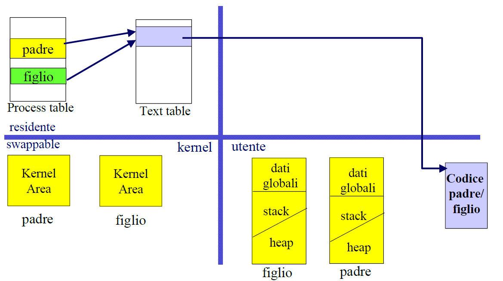
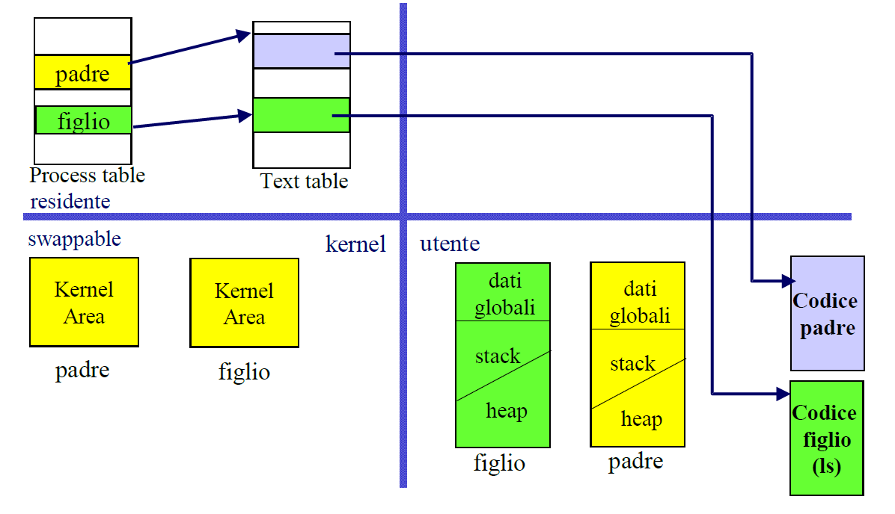

# SystemCReference

## Descrittore di processo

I singoli elementi della tabella dei processi sono delle strutture dati definite nel file `/usr/include/linux/sched.h`:

```c
extern struct task_struct *task[NR_TASKS];
```

L'implementazione della struttura dati è la seguente (nel file `tasks.h`):

```c
#define NR_TASKS 512

struct task_struct {
    /* stato del processo */
    volatile long state;

    /* identificatore del processo */
    pid_t pid;

    /* used id, effective user id, saved user id */
    uid_t uid, euid, suid;

    /* group id, effective group id, saved group id */
    gid_t gid, egid, sgid;

    /* tempo di esecuzione in tick (priorità dinamica) */
    long counter;

    /* priorità statica */
    long priority;

    /* maschera dei segnali ricevuti non ancora serviti */
    int sigpending;

    /* codice di terminazione e segnale che ha causato la terminazione */
    int exit_code, exit_signal;

    /* task seguente e precedente nella lista dei task */
    struct task_struct *next_run;
    struct task_struct *prev_run;

    /* padre originale */
    struct task_struct *p_opptr;

    /* padre attuale */
    struct task_struct *p_pptr;

    /* informazioni sui file aperti */
    struct files_struct *files;

    /* ... */
}
```

## Fork

Creazione di una fork:

```c
#include <unistd.h>

pid_t pid = fork();
```

Per eseguire una fork nel modo corretto la procedura di norma è la seguente:

```c
if (fork() == 0) {
    /* codice eseguito dal figlio */

    /* il figlio termina con il valore da ritornare al padre */
    exit(valore);
}
/* codice eseguito dal padre */
exit(0);
```

### Process identifier

Ogni processo può conoscere il proprio PID mediante la primitiva `getpid()`:

```c
int pid;
pid = getpid();
```

Inoltre, può conoscere il PID del padre (PPID) usando la primitiva `getppid()`:

```c
int ppid;
ppid = getppid();
```

### User identifier e group identifier

Altri attributi importanti di un processo sono UID e GID sia reali che effettivi. Essi si trovano nel descrittore del processo.
\
Ogni processo può conoscere i propri UID e GID usando rispettivamente le primitive `getuid()` e `getgid()`:

```c
/* UID reale */
int uid;
uid = getuid();
/* UID effettivo */
int euid;
euid = geteuid();

/* GID reale*/
int gid;
gid = getgid();
/* GID effettivo */
int egid;
egid = getegid();
```

## Sospensione di processo

Dopo la generazione di un processo figlio, il padre può decidere se operare contemporaneamente ad esso oppure se attentere il suo termine. Ciò è possibile utilizzando la primitiva `wait(&status)`. Essa sospsende l'esecuzione del processo padre in attesa della terminazione di uno dei processi figli:

```c
int status;
int pid;
pid = wait(&status);
```

#### Status

Se un figlio raggiunge il suo termine, la variabile `status` è un valore a 16 bit, dove nel byte alto si ha il valore restituito dalla exit di un figlio, mentre nel byte basso 0.
\
Nel caso in cui, invece, un figlio termina in seguito alla ricezione di un segnale, allora `status` ha 0 nel byte alto, mentre nel byte basso il numero del segnale che ha fatto terminare il figlio.

La primitiva `wait(&status)` ritorna -1 se il processo invocante non ha figli da attendere, oppure il PID del figlio terminato. Chiaramente, se non c'è nessun figlio da aspettare, la `wait(&status)` non ha effetto, quindi l'esecuzione del padre non viene sospesa.

#### Esempi di sincronizzazione tra padre e figlio

Caso 1:
```c
if ((pid = fork()) < 0)       
{ 
    /* fork fallita */
    printf("Errore in fork\n"); exit(1); 
}
if (pid == 0) 
{   
    /* codice eseguito dal figlio */
    exit(valore);   /* il figlio termina con uno specifico
    valore che verra' ritornato al padre */
}
/* codice eseguito dal padre */
pidfiglio = wait(&status);
exit(0);    /* terminazione del padre */
```

Caso 2: se il valore restituito dalla exit non interessa:
```c
if ((pid = fork()) < 0)       
{ 
    /* fork fallita */
    printf("Errore in fork\n"); exit(1); 
}
if (pid == 0) 
{   
    /* codice eseguito dal figlio */
    exit(valore);   /* il figlio termina con uno specifico
    valore che verra' ritornato al padre */
}
/* codice eseguito dal padre */
pidfiglio = wait((int *) 0);    /* viene ignorato il valore di status */
exit(0);    /* terminazione del padre */
```

*Attenzione*: è possibile ignorare il valore di ritorno della wait.

In caso di generazione di più figli, di norma, si utilizza un ciclo for per aspettarli tutti oppure attenderne uno con uno specifico pid:

```c
while((rid = wait(&status) != pid));
```

In supporto vengono definite in `sys/wait.h` le seguenti macro:
* `WIFEXITED(status)` e `WEXITSTATUS(status)`;
* `WIFSIGNALED(status)` e `WTERMSIG(status)`.

## Terminazione di un processo

Un processo può terminare in due possibili modi:
* **Involontario**: si verifica quando vengono eseguite *azioni non consentite* (es: riferimenti a indirizzi scorretti o tentativi di eseguire codice di operazioni non definite),*segnali generati dall'utente* (es: da tastiera o dal processo) oppure *segnali spediti da un altro processo* tramite la system call `kill`.
* **Volontario**: si verifica per invocazione della `exit(status)` (vedi seguito) o perché si ha raggiunto la fine del codice.

Per terminare un processo è buona pratica utilizzare `exit(status)`:

```c
int status;
exit(status);
```

La primitiva `exit(status)` chiude tutti i file aperti per il processo che termina. Il valore del parametro `status` viene passato al processo padre nel caso in cui esso abbia invocato la primitiva `wait(&status)`.

**Convenzioni**:
* Il valore 0 rappresenta il processo è terminato correttamente.
* Un qualsiasi valore diverso da 0 sta a indicare che si è verificato un problema durante l'esecuzione del processo.

*Esempio di utilizzo di `wait(&status)` e `exit(status)`*:

```c
int main()
{
    if ((pid = fork()) < 0)
    {
        /* fork fallita */
        printf("Errore in fork\n"); exit(1);
    }
    if (pid == 0) 
    {
        /* figlio */
        printf("Esecuzione del figlio\n");
        sleep(4);
        exit(5);    /* valore di ritorno che dovrebbe essere scelto
        in base al comportamento del codice eseguito dal figlio */
    }
    /* padre */
    if (wait(&status) < 0) 
    {
        printf("Errore in wait\n");
        exit(2);
    }
    if ((status & 0xFF) < 0) 
    {
        printf("Figlio terminato in modo anomalo\n");
    }
    else
    {
        ritorno = status >> 8;
        /* selezione degli 8 bit più significativi */
        ritorno &= 0xFF;
        printf("Per il figlio %d lo stato di EXIT e' %d\n", pid, ritorno);
    }
    exit(0);
}
```

*Osservazione*: combinando l'uso di `exit(status)` e `wait(&status)` si possono verificare due condizioni:
* Il processo figlio termina **prima** che il padre abbia chiamato `wait(&status)`: il processo figlio viene messo in stato zombie, ovvero terminato, ma in attesa di consegnare il valore `status` al padre. Tale stato termina quando il padre chiama la `wait(&status)`.
* Il processo padre termina prima dei suoi figli (inclusi gli zombie): tutti i processi figli vengono "adottati" dal processo Init. Quando un processo adottato da Init termina, esso non potrà mai diventare zombie perché Init rileva automaticamente il suo stato di terminazione.

## Exec

Per eseguire un programma diverso da quello attualmente in esecuzione, ma rimanendo all'interno dello stesso processo, si utilizzano delle primitive della famiglia `exec`. Di seguito alcuni esempi:

```c
execv(pathname, argv);
execl(pathname, argv0, argv1, ..., argvn, (char *)0);
execvp(name, arvg0, argv1, ..., argvn, (char *)0);
```

Chiaramente il nuovo programma deve essere un file eseguibile.
\
*Attenzione*: per convenzione il primo parametro deve essere sempre presente ed essere il nome del programma da eseguire.

### Nomenclatura delle exec di uso più frequente

Tutte le primitive di questa famiglia portano il nome `exec` seguito da alcune lettere che descrivono in che cosa ogni variante differisce dalle altre. Le più frequenti sono:
* `l`: la primitiva riceve una lista di argomenti terminata da NULL, ovvero `(char *)0`;
* `v`: la primitiva riceve un vettore di argomenti `argv[]`;
* `p`: la primitiva prende un nome relativo semplice di file come argomento e lo cerca nelle directory specificate nella variabile d'ambiente `PATH`;
* `e`: la primitiva riceve anche un vettore di `envp[]` che rimpiazza l'enviroment corrente.

#### Esempi d'uso di exec

`execv(pathname, argv)` (v = argomenti in vettore):

```c
int main()
{
    char *av[3];
    av[0] = "ls";
    av[1] = "-l";
    av[2] = (char *)0;

    printf("Esecuzione di ls\n");
    execv("/bin/ls/", av);

    printf("Errore in execv\n");
    exit(1);
}
```

`execl(pathname, argv0, ..., argvn, (char *)0)` (l = argomenti in lista):

```c
int main()
{
    printf("Esecuzione di ls\n");
    execl("/bin/ls", "ls", "-l", (char *)0);

    printf("Errore in execl\n");
    exit(1);
}
```

`execvp(name, argv)` (vp = argomenti in vettore e path):

```c
int main()
{
    char *argin[4];

    argin[0] = "myecho";
    argin[1] = "hello";
    argin[2] = "world!";
    argin[3] = (char *)0;

    printf("Esecuzione di myecho\n");
    execvp(argin[0], argin);

    printf("Errore in execvp\n");
    exit(1);
}

/* file myecho.c */
int main(int argc, char **argv) 
{
    int i;
    printf("Sono myecho\n");
    for (i = 0; i < argc; i++) 
    {
        printf("Argomento argv[%d] = %s\n", i, argv[i]);
    }
}
```

*Nota*:
\
La differenza tra `execl` e `execv` e rispettivamente `execlp` e `execvp` sta nel fatto che nelle prime due il nome del programma da eseguire deve essere determinato (pathname), mentre nelle altre due esso è un nome relativo semplice e la ricerca del file eseguibile avviene secondo il valore della variabile d'ambiente `PATH` (significato della p nel nome della primitiva).
\
Un file comandi per una certa shell può essere eseguito solo usando le primitive `execlp` e `execvp`.

Altre primitive della famiglia `exec`:

```c
execve(pathname, argv, envp);
execle(pathname, argv0, argv1, ..., argvn, (char *)0, envp);
```

Queste due primitive sono simili rispettivamente a `execv` e `execl`, con l'unica differenza che possono specificare un ambiene diverso (`envp`).

#### Esempio d'uso di `fork` ed `exec`

```c
int main()
{
    int pid;

    pid = fork();
    if (pid < 0)
    {
        /* fork fallita */
        printf("Errore in fork\n");
        exit(1);
    }

    if (pid == 0) 
    {
        /* figlio */
        printf("Esecuzione di ls\n");
        execl("/bin/ls", "ls", "-l", (char *)0);
        printf("Errore in execl\n");
        exit(-1);   /* valore che deve essere concordato con il padre */
    }
    /* padre */
    wait((int *)0);
    printf("Terminato ls\n");
    exit(0);
}
```

In questo caso la condivisione del codice tra padre e figlio termina subito dopo l'esecuzione di `execl` (assumendo che non avvengano errori) perché il processo figlio da quel momento esegue una copia del codice che, in questo caso, corrisponde a quello del comando `ls`. 

Prima della `execl`:
\


Dopo la `execl`:
\


### Simulazione del comportamento di una shell

```c
int main(int argc, char **argv)
{
    int pid, pidfiglio, status, ritorno;
    char st[80];

    /* ciclo infinito */
    for (;;)
    {
        printf("Inserire il comando da eseguire:\n");
        scanf("%s", st); /* N.B. legge una singola stringa */
        /* una volta ricevuto un comando si delega un figlio per eseguirlo */
        if ((pid = fork()) < 0) 
        {
            perror("fork"); exit(1);
        }
        if (pid == 0)
        {
            /* FIGLIO: esegue i comandi */
            execlp(st, st, (char *)0);
            perror("Errore esecuzione comando");
            exit(errno);
        }
        /* PADRE */
        /* attesa figlio: esecuzione in foreground */
        if (pidfiglio = wait(&status) < 0)
        {
            perror("Errore wait");
            exit(errno);
        }
        else
        {
            /* verifica la eventuale terminazione annormale del figlio; nel caso in cui invece sia normale, allora recupero il valore ritornato e lo stampo */
            printf("Eseguire altro comando? (si/no) \n");
            scanf("%s", st);
            if (strcmp(st, "si")) exit(0); /* uscita dal ciclo infinito */
        }   /* fine else */
    } /* fine for */
}
```

*Nota*: in caso di fallimento le system call ritornano tutte valore -1. Il loro valore di ritorno viene salvato sempre nella varibile globale `errno` definita nella libreria `errno.h` nella quale si trovano i codici di errore e le loro rispettive descrizioni.

*Nota*: `perror()` è una funzione utilizzata nella gestione degli errori. Essa stampa su `stderr` una stringa definita dall'utente seguita dallla descrizione del `errno` avvenuto.

## Pipe

I processi possono interagire tramite l'uso della primitiva `pipe(piped)`:

```c
int piped[2];
int retval;
retval = pipe(piped);
```

`retval` vale 0 in caso di successo, altrimenti ritorna un valore negativo. In caso di successo vengono occupati due elementi liberi nella tabella dei file aperti del processo e i rispettivi file descriptor vengono memorizzati in `piped[0]` e `piped[1]`.
