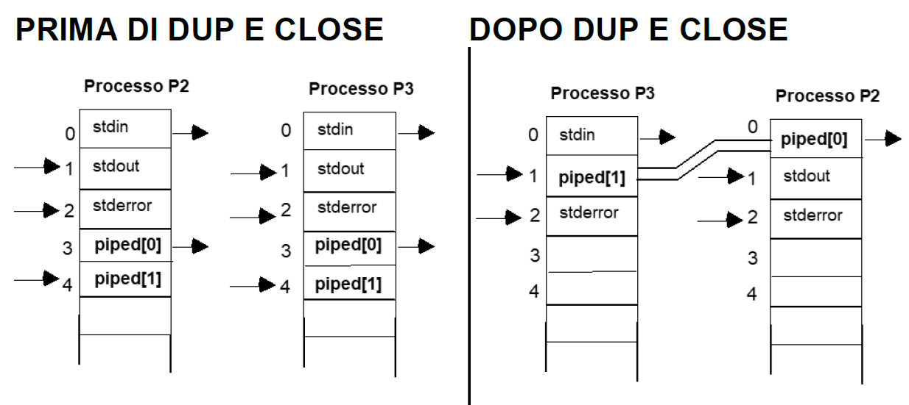

# SystemCReference

## Descrittore di processo

I singoli elementi della tabella dei processi sono delle strutture dati definite nel file `/usr/include/linux/sched.h`:

```c
extern struct task_struct *task[NR_TASKS];
```

L'implementazione della struttura dati è la seguente (nel file `tasks.h`):

```c
#define NR_TASKS 512

struct task_struct {
    // stato del processo  
    volatile long state;

    // identificatore del processo  
    pid_t pid;

    // used id, effective user id, saved user id  
    uid_t uid, euid, suid;

    // group id, effective group id, saved group id  
    gid_t gid, egid, sgid;

    // tempo di esecuzione in tick (priorità dinamica)  
    long counter;

    // priorità statica  
    long priority;

    // maschera dei segnali ricevuti non ancora serviti  
    int sigpending;

    // codice di terminazione e segnale che ha causato la terminazione  
    int exit_code, exit_signal;

    // task seguente e precedente nella lista dei task  
    struct task_struct *next_run;
    struct task_struct *prev_run;

    // padre originale  
    struct task_struct *p_opptr;

    // padre attuale  
    struct task_struct *p_pptr;

    // informazioni sui file aperti  
    struct files_struct *files;

    // ...  
}
```

## Tabella dei file aperti

La struttura dati presente in un descrittore di processo contiene, in particolare, la tabella dei file aperti:

```c
struct files_struct {
    // Maschera di bit di tutti i file descriptor usati (fino a 256)  
    fd_set open_fds;
    // Array di file descriptor  
    struct file* fd[NR_OPEN];
    // ...  
};
```

Dove `NR_OPEN` è definito nella libreria `fs.h`. In quest'ultima è definita anche la struttura `file`:

```c
struct file {
    // modalità di accesso (read only, read + write, write only)  
    mode_t f_mode;
    // file pointer all'interno del file (64 bit -> file > 2 GB)  
    loff_t f_pos;
    // ulteriori flag di open  
    unsigned short f_flags;
    // contatore di riferimenti  
    unsigned short f_count;
    // puntatore alla copia degli i-node del file  
    struct inode* f_inode;
    // ...  
};
```

Ed è definita in `fs.h` anche la struttura `inode`:

```c
struct inode {
    // descrizione del dispositvo (partizioine)  
    kdev_t i_dev;
    // numero dell'inode all'interno del dispositivo  
    unsigned long i_ino;
    // diritti di accesso  
    umode_t i_mode;
    // numero di hard link  
    nlink_t i_nlink;
    // user id e group id del proprietario  
    uid_t i_uid;
    gid_t i_gid;
    // dimensione (in byte)  
    off_t i_size;
    // tempo di ultimo accesso, modifica, modifica dell'i-node  
    time_t i_atime;
    time_t i_mtime;
    time_t i_ctime;
    // ...  
    // informazioni per lo specifico file system  
    union {
        struct minix_inode_info minix_i;
        struct ext_inode_info ext_i;
        struct ext2_inode_info ext2_i;
        struct hpfs_inode_info hpfs_i;
        struct msdos_inode_indo msdos_i;
        // ...  
    } u;
    // ...  
};
```

Prendendo in esame il file system ext2, in `Ext2_fs.h` troviamo:

```c
// numero di blocchi indirizzati direttamente  
#define EXT2_NDIR_BLOCKS 12

// indici dei puntatori ai blocchi che contengono indirizzi dei blocchi indiretti  
#define EXT2_IND_BLOCK EXT2_NDIR_BLOCKS
#define EXT2_DIND_BLOCK (EXT2_IND_BLOCK + 1)
#define EXT2_DIND_BLOCK (EXT2_DIND_BLOCK + 1)

// numero di elementi della tabella dei riferimenti ai blocchi  
#define EXT2_N_BLOCKS (EXT2_TIND_BLOCK + 1)

struct ext2_inode {
    // indirizzi dei blocchi  
    __u32 i_block[EXT2_N_BLOCKS];
    // ...  
};
```

Tabella degli i_block:
| Posizione | Contenuto |
|:---|:---|
| 0 -> (EXT2_NDIR_BLOCKS - 1) | 12 riferimenti diretti |
| EXT2_IND_BLOCK | Riferimento indiretto di primo livello |
| EXT2_DIND_BLOCK | Riferimento indiretto di secondo livello |
| EXT2_TIND_BLOCK | Riferimento indiretto di terzo livello |

## Sync

La primitiva `sync()` serve per effettuare un flush periodico (generalmente una volta ogni 30 secondi) di tutte le informazioni in memoria centrale sui dischi. Inoltre, questa operazione viene sempre eseguita quando si effettua lo shutdown di un sistema UNIX.

## Fork

Creazione di una fork:

```c
#include <unistd.h>

pid_t pid = fork();
```

Per eseguire una fork nel modo corretto la procedura di norma è la seguente:

```c
if (fork() == 0) {
    // codice eseguito dal figlio  

    // il figlio termina con il valore da ritornare al padre  
    exit(valore);
}
// codice eseguito dal padre  
exit(0);
```

### Process identifier

Ogni processo può conoscere il proprio PID mediante la primitiva `getpid()`:

```c
int pid;
pid = getpid();
```

Inoltre, può conoscere il PID del padre (PPID) usando la primitiva `getppid()`:

```c
int ppid;
ppid = getppid();
```

### User identifier e group identifier

Altri attributi importanti di un processo sono UID e GID sia reali che effettivi. Essi si trovano nel descrittore del processo.
\
Ogni processo può conoscere i propri UID e GID usando rispettivamente le primitive `getuid()` e `getgid()`:

```c
// UID reale  
int uid;
uid = getuid();
// UID effettivo  
int euid;
euid = geteuid();

// GID reale 
int gid;
gid = getgid();
// GID effettivo  
int egid;
egid = getegid();
```

## Sospensione di processo

Dopo la generazione di un processo figlio, il padre può decidere se operare contemporaneamente ad esso oppure se attentere il suo termine. Ciò è possibile utilizzando la primitiva `wait()`. Essa sospsende l'esecuzione del processo padre in attesa della terminazione di uno dei processi figli:

```c
int status;
int pid;
pid = wait(&status);
```

#### Status

Se un figlio raggiunge il suo termine, la variabile `status` è un valore a 16 bit, dove nel byte alto si ha il valore restituito dalla exit di un figlio, mentre nel byte basso 0.
\
Nel caso in cui, invece, un figlio termina in seguito alla ricezione di un segnale, allora `status` ha 0 nel byte alto, mentre nel byte basso il numero del segnale che ha fatto terminare il figlio.

La primitiva `wait()` ritorna -1 se il processo invocante non ha figli da attendere, oppure il PID del figlio terminato. Chiaramente, se non c'è nessun figlio da aspettare, la `wait()` non ha effetto, quindi l'esecuzione del padre non viene sospesa.

#### Esempi di sincronizzazione tra padre e figlio

Caso 1:

```c
if ((pid = fork()) < 0)
{
    // fork fallita  
    printf("Errore in fork\n"); exit(1);
}
if (pid == 0)
{
    // codice eseguito dal figlio  
    exit(valore);   // il figlio termina con uno specifico
    valore che verrà ritornato al padre  
}
// codice eseguito dal padre  
pidfiglio = wait(&status);
exit(0);    // terminazione del padre  
```

Caso 2: se il valore restituito dalla exit non interessa:

```c
if ((pid = fork()) < 0)
{
    // fork fallita  
    printf("Errore in fork\n"); exit(1);
}
if (pid == 0)
{
    // codice eseguito dal figlio  
    exit(valore);   // il figlio termina con uno specifico
    valore che verrà ritornato al padre  
}
// codice eseguito dal padre  
pidfiglio = wait((int *) 0);    // viene ignorato il valore di status  
exit(0);    // terminazione del padre  
```

_Attenzione_: è possibile ignorare il valore di ritorno della wait.

In caso di generazione di più figli, di norma, si utilizza un ciclo for per aspettarli tutti oppure attenderne uno con uno specifico pid:

```c
while((rid = wait(&status) != pid));
```

In supporto vengono definite in `sys/wait.h` le seguenti macro:

- `WIFEXITED(status)` e `WEXITSTATUS(status)`;
- `WIFSIGNALED(status)` e `WTERMSIG(status)`.

## Terminazione di un processo

Un processo può terminare in due possibili modi:

- **Involontario**: si verifica quando vengono eseguite _azioni non consentite_ (es: riferimenti a indirizzi scorretti o tentativi di eseguire codice di operazioni non definite),_segnali generati dall'utente_ (es: da tastiera o dal processo) oppure _segnali spediti da un altro processo_ tramite la system call `kill`.
- **Volontario**: si verifica per invocazione della `exit()` (vedi seguito) o perché si ha raggiunto la fine del codice.

Per terminare un processo è buona pratica utilizzare `exit()`:

```c
int status;
exit(status);
```

La primitiva `exit()` chiude tutti i file aperti per il processo che termina. Il valore del parametro `status` viene passato al processo padre nel caso in cui esso abbia invocato la primitiva `wait()`.

**Convenzioni**:

- Il valore 0 rappresenta il processo è terminato correttamente.
- Un qualsiasi valore diverso da 0 sta a indicare che si è verificato un problema durante l'esecuzione del processo.

_Esempio di utilizzo di `wait()` e `exit()`_:

```c
int main()
{
    if ((pid = fork()) < 0)
    {
        // fork fallita  
        printf("Errore in fork\n"); exit(1);
    }
    if (pid == 0)
    {
        // figlio  
        printf("Esecuzione del figlio\n");
        sleep(4);
        exit(5);    // valore di ritorno che dovrebbe essere scelto
        in base al comportamento del codice eseguito dal figlio  
    }
    // padre  
    if (wait(&status) < 0)
    {
        printf("Errore in wait\n");
        exit(2);
    }
    if ((status & 0xFF) < 0)
    {
        printf("Figlio terminato in modo anomalo\n");
    }
    else
    {
        ritorno = status >> 8;
        // selezione degli 8 bit più significativi  
        ritorno &= 0xFF;
        printf("Per il figlio %d lo stato di EXIT è %d\n", pid, ritorno);
    }
    exit(0);
}
```

_Osservazione_: combinando l'uso di `exit()` e `wait()` si possono verificare due condizioni:

- Il processo figlio termina **prima** che il padre abbia chiamato `wait()`: il processo figlio viene messo in stato zombie, ovvero terminato, ma in attesa di consegnare il valore `status` al padre. Tale stato termina quando il padre chiama la `wait()`.
- Il processo padre termina prima dei suoi figli (inclusi gli zombie): tutti i processi figli vengono "adottati" dal processo Init. Quando un processo adottato da Init termina, esso non potrà mai diventare zombie perché Init rileva automaticamente il suo stato di terminazione.

## Exec

Per eseguire un programma diverso da quello attualmente in esecuzione, ma rimanendo all'interno dello stesso processo, si utilizzano delle primitive della famiglia `exec`. Di seguito alcuni esempi:

```c
execv(pathname, argv);
execl(pathname, argv0, argv1, ..., argvn, (char *)0);
execvp(name, arvg0, argv1, ..., argvn, (char *)0);
```

Chiaramente il nuovo programma deve essere un file eseguibile.
\
_Attenzione_: per convenzione il primo parametro deve essere sempre presente ed essere il nome del programma da eseguire.

### Nomenclatura delle exec di uso più frequente

Tutte le primitive di questa famiglia portano il nome `exec` seguito da alcune lettere che descrivono in che cosa ogni variante differisce dalle altre. Le più frequenti sono:

- `l`: la primitiva riceve una lista di argomenti terminata da NULL, ovvero `(char *)0`;
- `v`: la primitiva riceve un vettore di argomenti `argv[]`;
- `p`: la primitiva prende un nome relativo semplice di file come argomento e lo cerca nelle directory specificate nella variabile d'ambiente `PATH`;
- `e`: la primitiva riceve anche un vettore di `envp[]` che rimpiazza l'enviroment corrente.

#### Esempi d'uso di exec

`execv(pathname, argv)` (v = argomenti in vettore):

```c
int main()
{
    char *av[3];
    av[0] = "ls";
    av[1] = "-l";
    av[2] = (char *)0;

    printf("Esecuzione di ls\n");
    execv("/bin/ls/", av);

    printf("Errore in execv\n");
    exit(1);
}
```

`execl(pathname, argv0, ..., argvn, (char *)0)` (l = argomenti in lista):

```c
int main()
{
    printf("Esecuzione di ls\n");
    execl("/bin/ls", "ls", "-l", (char *)0);

    printf("Errore in execl\n");
    exit(1);
}
```

`execvp(name, argv)` (vp = argomenti in vettore e path):

```c
int main()
{
    char *argin[4];

    argin[0] = "myecho";
    argin[1] = "hello";
    argin[2] = "world!";
    argin[3] = (char *)0;

    printf("Esecuzione di myecho\n");
    execvp(argin[0], argin);

    printf("Errore in execvp\n");
    exit(1);
}

// file myecho.c  
int main(int argc, char **argv)
{
    int i;
    printf("Sono myecho\n");
    for (i = 0; i < argc; i++)
    {
        printf("Argomento argv[%d] = %s\n", i, argv[i]);
    }
}
```

_Nota_:
\
La differenza tra `execl` e `execv` e rispettivamente `execlp` e `execvp` sta nel fatto che nelle prime due il nome del programma da eseguire deve essere determinato (pathname), mentre nelle altre due esso è un nome relativo semplice e la ricerca del file eseguibile avviene secondo il valore della variabile d'ambiente `PATH` (significato della p nel nome della primitiva).
\
Un file comandi per una certa shell può essere eseguito solo usando le primitive `execlp` e `execvp`.

Altre primitive della famiglia `exec`:

```c
execve(pathname, argv, envp);
execle(pathname, argv0, argv1, ..., argvn, (char *)0, envp);
```

Queste due primitive sono simili rispettivamente a `execv` e `execl`, con l'unica differenza che possono specificare un ambiene diverso (`envp`).

#### Esempio d'uso di `fork` ed `exec`

```c
int main()
{
    int pid;

    pid = fork();
    if (pid < 0)
    {
        // fork fallita  
        printf("Errore in fork\n");
        exit(1);
    }

    if (pid == 0)
    {
        // figlio  
        printf("Esecuzione di ls\n");
        execl("/bin/ls", "ls", "-l", (char *)0);
        printf("Errore in execl\n");
        exit(-1);   // valore che deve essere concordato con il padre  
    }
    // padre  
    wait((int *)0);
    printf("Terminato ls\n");
    exit(0);
}
```

In questo caso la condivisione del codice tra padre e figlio termina subito dopo l'esecuzione di `execl` (assumendo che non avvengano errori) perché il processo figlio da quel momento esegue una copia del codice che, in questo caso, corrisponde a quello del comando `ls`.

Prima della `execl`:
\


Dopo la `execl`:
\


### Simulazione del comportamento di una shell

```c
int main(int argc, char **argv)
{
    int pid, pidfiglio, status, ritorno;
    char st[80];

    // ciclo infinito  
    for (;;)
    {
        printf("Inserire il comando da eseguire:\n");
        scanf("%s", st); // N.B. legge una singola stringa  
        // una volta ricevuto un comando si delega un figlio per eseguirlo  
        if ((pid = fork()) < 0)
        {
            perror("fork"); exit(1);
        }
        if (pid == 0)
        {
            // FIGLIO: esegue i comandi  
            execlp(st, st, (char *)0);
            perror("Errore esecuzione comando");
            exit(errno);
        }
        // PADRE  
        // attesa figlio: esecuzione in foreground  
        if (pidfiglio = wait(&status) < 0)
        {
            perror("Errore wait");
            exit(errno);
        }
        else
        {
            // verifica la eventuale terminazione annormale del figlio; nel caso in cui invece sia normale, allora recupero il valore ritornato e lo stampo  
            printf("Eseguire altro comando? (si/no) \n");
            scanf("%s", st);
            if (strcmp(st, "si")) exit(0); // uscita dal ciclo infinito  
        }   // fine else  
    } // fine for  
}
```

_Nota_: in caso di fallimento le system call ritornano tutte valore -1. Il loro valore di ritorno viene salvato sempre nella varibile globale `errno` definita nella libreria `errno.h` nella quale si trovano i codici di errore e le loro rispettive descrizioni.

_Nota_: `perror()` è una funzione utilizzata nella gestione degli errori. Essa stampa su `stderr` una stringa definita dall'utente seguita dallla descrizione del `errno` avvenuto.

## Pipe

I processi possono interagire tramite l'uso della primitiva `pipe()`:

```c
int piped[2];
int retval;
retval = pipe(piped);
```

`retval` vale 0 in caso di successo, altrimenti ritorna un valore negativo. In caso di successo vengono occupati due elementi liberi nella tabella dei file aperti del processo e i rispettivi file descriptor vengono memorizzati in `piped[0]` e `piped[1]` che rappresentano rispettivamente il lato di lettura e quello di scrittura sulla pipe. Per leggere e scrivere si usano le primitive `read()` e `write()`. Allo stesso modo può essere utilizzata la `close()` per chiudere uno dei lati della pipe.
\
In conclusione, ognuno dei due lati della pipe viene visto dal processo esattamente come un file.

#### Differenze rispetto ai file

- I file descriptor dei due lati della pipe non corrispondono ai nomi nel file system. Una pipe è una struttura che non permane alla terminazione dei processi.
- La dimensione di una pipe è fissa: ad essa è associato un buffer.
- Una pipe prevede la gestione fifo dei file bufferizzati.
- Vi è un rapporto di sincronia del tipo produttore-consumatore. Un processo consumatore che legge da `piped[0]` si blocca se la pipe è vuota e attende che arrivino dei dati. Un processo produttore che scrive su `piped[1]` si blocca se la pipe è piena e attende che si liberi spazio.

### Determinare la lunghezza di una pipe (esempio)

```c
#include <stdio.h>

int count;

int main()
{
    int piped[2];
    char c = 'x';
    if (pipe(piped) < 0)
    {
        printf("Errore\n");
        exit(1);
    }
    for (count = 0;;)
    {
        write(piped[1], &c, 1); // scrittura sulla pipe  
        if ((++count % 1024) == 0)
        {
            printf("%d caratteri nella pipe\n", count);
        }
    }
    exit(0);
}
```

_Osservazione_: dovremmo abortire l'esecuzione di questo codice perché la `write()` si bloccherà quando avrà saturato la dimensione fissa della pipe dato che non ci sarà alcun processo che agisce come consumatore.

La lunghezza di una pipe su Linux per esempio può essere (specialmente nelle macchine virtuali) 65536 byte (64 kB).

### Comunicazione tra processi della stessa gerarchia tramite pipe

```c
int main()
{
    int pid, piped[2];
    char msg[] = "ciao";
    pipe(piped);    // CREAZIONE PIPE: due elementi in più nella TFA del processo padre  
    if (pid = fork() == 0)
    {
        // figlio: eredita per copia la TFA del padre oltre alla copia dell'array pd  
        write(piped[1], msg, 5);    // figlio scrive sulla pipe  
        exit(0);
    }
    // padre: legge dalla pipe  
    read(piped[0], msg, 5);
    exit(0);
}
```

_Nota_: per evitare problemi di deadlock la comunicazione tra padre e figlio deve essere sempre **unidirezionale**. Se il padre legge e il figlio scrive, allora dopo la creazione delle pipe il padre deve chiudere il lato di scrittura tramite `close()` e il figlio (dopo essere stato creato tramite `fork()`) deve chiudere il lato di lettura. Vale il ragiornamento duale nel caso in cui il padre scrive e il figlio legge.

### Pipe rimane senza scrittore durante l'esecuzione

Comportamento standard nel caso in cui il processo scrittore (figlio) venga terminato prima che la pipe venga chiusa dal processo lettore (padre):

```c
#include <stdio.h>

int main(int argc, char **argv)
{
    // ...  
    if (pid == 0)
    {
        // figlio  
        int fd;
        close(piped[0]);    // figlio chiude il lato lettura  
        printf("Figlio %d sta per iniziare a scrivere...");
        // il figlio termina, dunque la pipe resta senza scrittore  
        exit(0);
    }
    // padre  
    close(piped[1]);    // padre chiude il lato scrittura  
    while (read(piped[0], inpbuf, MSGSIZE))
    {
        if (j != 0)
        {
            // operazioni da svolgere in caso il figlio abbia scritto qualcosa  
        }
        else
        {
            puts("Non c'è alcun scrittore");
            exit(4);
        }
    }
}
```

**Importante**: la primitiva `read()` ritorna 0 se non ci sono dati da leggere e se non ci sono processi scrittori attivi. Ciò significa che se il processo figlio non scrive nulla, ma non ha ancora chiuso il suo lato di pipe, allora il ciclo continua.

### Pipe rimane senza lettore durante l'esecuzione

Comportamento standard nel caso in cui il processo lettore (padre) venga terminato prima che la pipe venga chiusa dal processo scrittore (figlio):

```c
#include <stdio.h>

int main()
{
    // ...  
    if (pid == 0)
    {
        // figlio  
        int fd;
        close(piped[0]);    // figlio chiude il lato lettura  
        // ...apertura del file fd...  
        printf("Figlio %d sta per iniziare a scrivere...");
        while (read(fd, mess, MSGSIZE))
        {
            mess[MSGSIZE - 1] = '\0';
            write(piped[1], mess, MSGSIZE);
            j++;
        }
        printf("Figlio ha scritto %d messaggi sulla pipe\n", j);
        exit(0);
    }
    // padre  
    close(piped[1]);    // padre chiude il lato scrittura  
    // il padre termina, quindi il figlio resta senza lettore  
    exit(0);
}
```

Il sistema in tal caso spedisce il segnale `SIGPIPE` al processo scrittore per avvisarlo del fatto che non ci sono più processi lettori. Di default questo segnale provoca la terminazione del processo che lo riceve. Tale comportamento è necessario per evitare che la pipe si saturi e il processo scrittore proceda a scrivere fino a bloccarsi in un momento postumo indefinito.

## Dup

La primitiva `dup()` serve per duplicare un elemento della tabella dei file aperti di processo:

```c
int fd;     // file descriptor del file da duplicare  
int retval;
retval = dup(fd);
```

L'effetto di questa primitiva è copiare l'elemento di indice `fd` della TFA del processo interessato nella prima posizione libera della stessa con l'indice minimo tra quelli disponibili.
\
`dup()` restituisce il nuovo file descriptor, ovvero il nuovo indice della TFA, oppure, in caso di fallimento, -1.

Questa primitiva può essere usata in generale per copiare qualunque file descriptor, ma in particolare viene usata soprattutto per copiare i file descriptor di una pipe e realizzare quindi il piping di comandi.

### Esempio di piping di comandi (semplificato)

```c
#include <stdio.h>

int main(int argc, char**argv)
{
    int j, i;
    char *com1[10], *com2[10];
    int pid, piped[2];
    int pidfiglio, status, ritorno;

    // processo P1: simulazione del processo shell  
    // si devono fornire nella linea comandi due comandi distinti, separati dal carattere '!'. Non si usa direttamente '|' perché la shell lo interpreta direttamente nel suo linguaggio  
    if (argc < 4)   // devono esserci almeno 3 stringhe  
    {
        printf("Errore nel numero di parametri");
        exit(1);
    }
    for (i = 1; i < argc && strcmp(argv[i], "!"); i++)
    {
        com1[i - 1] = argv[i];
    }
    com1[i - 1] = (char *)0;
    i++;
    for (j = 1; i < argc; i++, j++)
    {
        com2[j - 1] = argv[i];
    }
    com2[j - 1] = (char *)0;    // terminatore  

    // creazione del figlio per eseguire il comando in pipe  
    if ((pid = fork()) < 0)
    {
        // errore...  
    }
    if (pid == 0)
    {
        // figlio = processo P2  

        // il figlio P2 tratta il comando intero: crea la pipe  
        if (pipe(piped) < 0)
        {
            exit(-1);
        }
        // creazione di un nuovo figlio = processo P3  
        if ((pid = fork()) < 0)
        {
            exit(-1);
        }
        if (pid == 0)
        {
            // processo P3 figlio di P2 figlio di P1  
            close(1);           // l'output va messo sulla pipe, quindi posso chiudere stdout  
            dup(piped[1]);      // avendo chiuso con l'istruzione precedente stdout di indice 1, questa operazione di duplicazione del file
                                // descriptor di piped[1] troverà sicuramente come prima posizione libera l'indice 1, 
                                // quindi stdout è effettivamente stato sostituito da una copia del file descriptor di piped[1] 
            close(piped[0]);
            close(piped[1]);    // i lati pipe non servono più 
            execvp(com1[0], com1);
            exit(-1);           // errore in caso si ritorni qui dopo la exec  
        }
        // processo P2 (padre di P3)  
        close(0);           // posso chiudere stdin perché l'input lo prendo dalla pipe  
        dup(piped[0]);      // vale lo stesso ragionamento che è stato fatto in P3 riguardo piped[1] e stdout  
        close(piped[0]);
        close(piped[1]);
        execvp(com2[0], com2);
        exit(-1);           // errore in caso si ritorni qui dopo la exec  
    }
    // processo P1 padre di P2  
    if ((pidfiglio = wait(&status)) < 0)
    {
        // errore  
    }
    // recupero del valore di ritorno  
    exit(ritorno);
}
```



## Segnali

Un metodo alternativo per la sincronizzazione in UNIX sono i segnali.

Elenco dei segnali più comuni:

```c
SIGHUP 1        // hangup: disconnessione dal terminale (logout)
SIGINT 2        // interrupt da terminale
SIGQUIT 3       // quit da un programa con core
SIGILL 4        // istruzione non consentita (core)
...
SIGKILL 9       // uccisione del processo non intercettabile o ignorabile
...
SIGSYS 12       // errore di argomento nella system call (core)
SIGPIPE 13      // scrittura su pipe priva di lettore
SIGALARM 14     // allarme da orologio
SIGTERM 15      // terminazione software
SIGUSR1 16      // user interrupt 1
SIGUSR2 17      // user interrupt 2
SIGCHLD 18      // morte di un processo figlio
...
```

Dove `SIGUSR1` e `SIGUSR2` sono segnali lasciati all'utente.

_Attenzione_: la numerazione di alcuni segnali potrebbe essere diversa!

### Primitive

La primitiva che consente di assegnare a un segnale un comportamento definito dal programmatore è la seguente:

```c
#include <signal.h>

void* signal(int sig, void* func(int)) (int);
```

Dove `int sig` è il tipo di segnale e `void* func` è un puntatore alla funzione che determina come trattare il segnale. 

Si hanno 3 possibilità nell'uso di questa funzione:

1) Specificare l'indirizzo di un handler per il segnale `sig`. Al verificarsi di quest'ultimo viene invocato l'handler. Esso può eseguire qualsiasi operazione, dopodiché si ritornerà al processo interrotto oppure terminare l'esecuzione del processo.

2) Riportare all'azione di default assegnando `SIG_DFL` al posto dell'handler.

3) Ignorare il segnale assegnando `SIG_IGN` al posto dell'handler.